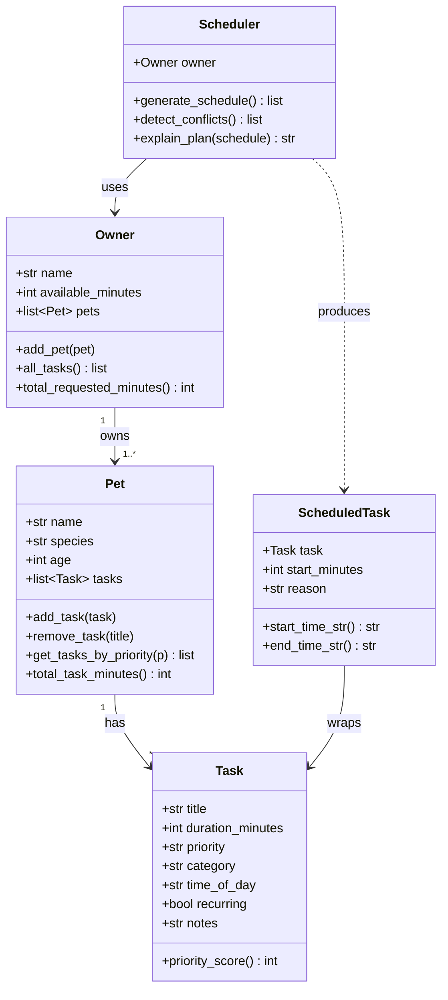

# PawPal+ Project Reflection

## 1. System Design

**a. Initial design**

I designed four core classes based on the real-world entities in the scenario:

- **Task** (dataclass): Holds a single care item — its title, duration, priority (low/medium/high), category (walk/feeding/medication/grooming/enrichment), optional time-of-day preference, and notes. I used a Python dataclass because the data is plain and immutable once created.
- **Pet** (dataclass): Owns a list of Tasks and exposes helpers like `add_task`, `remove_task`, and `get_tasks_by_priority`. It represents the animal being cared for.
- **Owner**: Holds a list of Pets and a daily `available_minutes` budget. It acts as the single entry point for the scheduler to pull all tasks via `all_tasks()`.
- **Scheduler**: Takes an Owner and runs the scheduling algorithm in `generate_schedule()`. It also exposes `detect_conflicts()` and `explain_plan()` as separate responsibilities.
- **ScheduledTask** (dataclass): A thin wrapper that pairs a Task with a `start_minutes` integer and a human-readable `reason` string — produced by the Scheduler and consumed by the UI.

UML (Mermaid):

Three core user actions: add a pet, add/remove tasks, generate a daily schedule.

**b. Design changes**

My initial sketch didn't include `ScheduledTask` — I planned to return raw `Task` objects from the scheduler with a parallel list of start times. During implementation I realized this led to messy code passing two lists around, so I created `ScheduledTask` to bundle `(task, start_minutes, reason)` together. This made the UI code and the `explain_plan` method much cleaner because each item is self-contained.

---

## 2. Scheduling Logic and Tradeoffs

**a. Constraints and priorities**

The scheduler considers:
1. **Priority** (high → medium → low) — highest weight; a high-priority task will always be scheduled before a medium one.
2. **Duration** (shorter first within same priority) — secondary sort; this is a greedy "fit as many tasks as possible" heuristic.
3. **Time-of-day preference** — a task marked "morning" is held until 8 AM, "afternoon" until 12 PM, "evening" until 5 PM. This prevents, for example, a medication appearing at 5 PM when the owner marked it as a morning task.
4. **Available minutes budget** — the owner's total daily budget; tasks that would exceed it are skipped.
5. **Day window** (8 AM – 8 PM) — no task can run past 20:00.

Priority was ranked highest because a medication missed due to time pressure is more consequential than a grooming session missed.

**b. Tradeoffs**

The scheduler uses a greedy approach: it never backtracks or tries alternative orderings. This means it can miss a globally-optimal packing. For example, if a high-priority 60-minute task leaves only 5 minutes before the afternoon window, a 10-minute medium-priority task might be pushed to afternoon even though it could fit right after the high-priority task with a minor reordering.

This is a reasonable tradeoff because pet care tasks are mostly independent (you can do feeding before or after a walk without much difference), and the greedy solution is predictable, easy to explain, and fast enough for a typical daily schedule of 5–15 tasks.

---

## 3. AI Collaboration

**a. How you used AI**

I used AI to brainstorm the initial class structure and responsibilities, generate the Mermaid UML, scaffold the dataclass stubs, and review the scheduling algorithm for edge cases. The most helpful prompts were specific and structural: "Given these four classes and their relationships, generate a Mermaid class diagram" and "What edge cases could break a greedy priority-based scheduler for pet tasks?"

**b. Judgment and verification**

When the AI suggested storing `start_time` as a formatted string directly on `Task`, I didn't accept it. A `Task` is a reusable template — it shouldn't know what time it was scheduled on a particular day. I kept `Task` pure and moved the time assignment to `ScheduledTask`, which is produced per scheduling run. I verified this by writing the `test_time_of_day_morning_preference` test, confirming `start_minutes` on `ScheduledTask` is always >= 480 (8 AM) for morning-preference tasks.

---

## 4. Testing and Verification

**a. What you tested**

- `Task` validation: invalid priorities and non-positive durations raise `ValueError`.
- `Pet` task management: add, remove, filter by priority, and total minute calculation.
- `Owner` aggregation: `all_tasks()` across multiple pets, total requested minutes.
- `Scheduler` core behaviors: result is a list, total scheduled time never exceeds the budget, high-priority tasks appear before medium ones, no task ends after 20:00, conflicts are reported when budget is exceeded, explanations are non-empty.
- Time-of-day preference: morning tasks start between 8 AM and noon.
- Utility: `minutes_to_time_str` produces correct AM/PM strings at midnight, 8 AM, noon, and 5 PM.

These tests are important because the scheduler's core guarantees — respect budget, respect priority order, never overflow the day — are exactly what users depend on.

**b. Confidence**

High confidence for the happy path. Edge cases I would test next: tasks whose combined morning-slot time exceeds the available morning window, a pet with zero tasks, an owner with two pets where the same category appears in both, and a task with a duration longer than the full available budget (should be skipped cleanly, not crash).

---

## 5. Reflection

**a. What went well**

The clean separation between the domain layer (`pawpal_system.py`) and the UI (`app.py`) made iteration smooth. Once the CLI demo verified that `Scheduler.generate_schedule()` returned correct results, wiring it to Streamlit was straightforward. The dataclass-based design also kept the test code readable.

**b. What you would improve**

I would add support for recurring tasks with specific days of the week (e.g., "vet appointment every Tuesday") and a proper time-slot conflict check between tasks that both request the same narrow window. I would also separate the `Scheduler` into a `ConstraintChecker` and a `Planner` to keep each class focused on one responsibility.

**c. Key takeaway**

Designing classes before writing logic forced clarity about what each object should *own* vs. what it should *delegate*. When I started coding, the hard questions were already answered: `Pet` holds tasks, `Owner` holds pets, `Scheduler` does not mutate either — it only reads and produces `ScheduledTask` outputs. AI was most valuable as a sounding board for those design decisions, not as a code generator.
